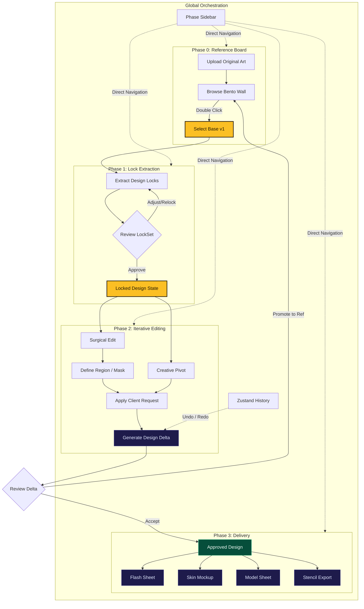

# Tattoo Lock System (TLS) Workflow

This diagram outlines the core operational loop of the TLS studio, from initial design intake to final production assets.

## Workflow Principles

1.  **Artist-First Intake**: The process starts with an artist's original work (e.g., from Procreate). The system is a **controlled assistant**, not a replacement for the first creative act.
2.  **Design Identity Protection**: "Locks" are extracted early and enforced throughout the refinement phases to prevent "AI drift" and preserve the approved identity.
3.  **Client-Driven Revisions**: The **Surgical Edit** phase translates natural client language ("make the snake wrap tighter") into precise visual adjustments.
4.  **Promote & Loop**: The "Promote to Reference" mechanism allows for a non-linear workflow where any output can become the new source of truth for the next iteration.
5.  **Production Readiness**: Deliverables like Stencils and Mockups are only prioritized after the design is locked and approved.
